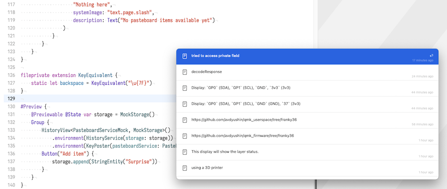
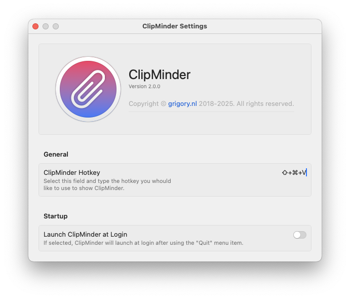

# ClipMinder

ClipMinder is a simple clipboard manager for macOS. It is written in Swift and uses SwiftUI.

## Features

- Clipboard history
- Keyboard shortcuts
- Customizable number of items to keep in history
- Customizable keyboard shortcut to show/hide the app

## Screenshots

